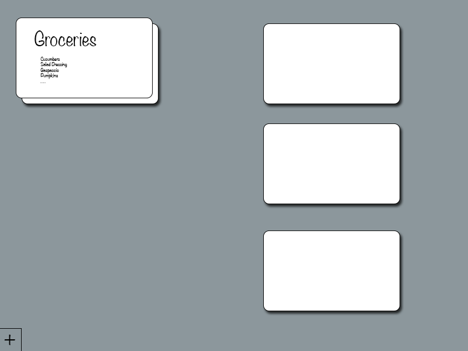

# Notecards all the way down

A recursive notecard app.  Incomplete - Still a _**WIP**_

## Background

A friend (`friend-one`) wanted this app.  I decided I wanted to do it, but not put much effort into it.

`friend-one`:
> actually i have an idea for a webapp but i don’t know if anyone but me would ever use it
>
> i have a raging hardon for hierarchical lists that can nest at n layers. i live and breathe workflowy, which is basically that - bullets with infinite levels
>
> but doing that with notecards would be nice
>
> like, you have a notecard with a title, but you can “zoom in” on that notecard to see all the notecards within it
>
> kind of like in Snow Crash, how they used things that looked like business cards to carry all sorts of data

`friend-two`:
> So you have a dashboard filled with notecards, and you can click to edit them, and the notecard size grows to contain the list?
>
> Can you link notecards?
>
> Pretty much my life run by is a series of indented items. e.g.:

```
PR for deprecations
    done
git-crypt
    install git-crypt on staging1
        done
    generate keys for role account
        done
        imported on staging1
    add to authorship
        done
    whitelist test file
        done
    encrypt
        automatic
    push
    done
leads creation failure
merge master into rails-integration
    done
Liz
    reached out
```

> The top level is what I need to do. Indented are updates, or prerequisite tasks

`friend-one`:
> pretty much same for me

`friend-two`:
> I live on the edge by keeping it in a scratch buffer, and never write it to disk

`friend-one`:
> yes, each notecard can open up to become a new dashboard with its own notecards, with references to associated cards at the same or other levels
>
> lol you are brave

`friend-two`:
> Notecards all the way down?

`friend-one`:
> yes
>
> i think my workflowy has something like 15,000 bulleted items in it now
>
> i use it for literally everything
>
> it’s just not great for visual things
>
> a fractal corkboard would make my life 10x better

`friend-two`:
> You want Pintrest?
>
> Pintrest: Recursive Edition?

`friend-one`:
> well, something with more organization than pinterest
>
> so yeah pinterest with recursion would be good
>
> well, except that pinterest requires some media to base a post on
>
> so pinterest for plaintext + media

`friend-two`:
> Can you make some wireframes? Could be fun
>
> Maybe I’ll give React.JS a spin

`friend-one`:
> yeah give me a few to cook the idea and draw some up

`friend-two`:
> Have you used Balsamiq ?

`friend-one`:
> only when making a bread plate :V
>
> brb work
>
> uploaded an image: notecardwf.png


`friend-two`:
> > brb work

> Classic
>
> Slack is the top priority. Work must come second

`friend-one`:
> anyway, the idea is, if a notecard has child items, you’d see a preview of those items as a list (like the groceries). you can create child notecards going either way - if you are looking at the card itself, you add line items to the card using a traditional list view, but each of those line items also spawns a card that has the same contents, so you can ‘unpack’ the list into individual cards, and carry on creating items on those cards as child items

`friend-two`:
> So given a list:

```
* Item 1
  * Subitem 1
```

> Item 1 is a notecard, and you can see Subitem 1 as a list item, but clicking “Subitem 1” expands a new notecard for Subitem 1?
>
> And Subitem 1 can have its own subitems, and so on?
>
> When do subitems become notecards? Automatically?

`friend-one`:
> yes
>
> everything is a notecard and a list item

`friend-three`:
> Everything is notecards. That is your design doc

`friend-one`:
> ^
>
> get to work, we’re done
>
> lmk when you’re done and i’ll start using it

`friend-three`:
> THEN we can slap ads on it, get some SEO, and retire. (Notice how I said we. I summarized the design doc for you)

`friend-one`:
> that’s how this team works, right? i’m the golden goose, friend-one and kelner do the work, and friend-three is middle management

`me`
> Hey this almost sounds like real life, just got voluntold to work on something I know nothing about and there is a one sentence design doc
